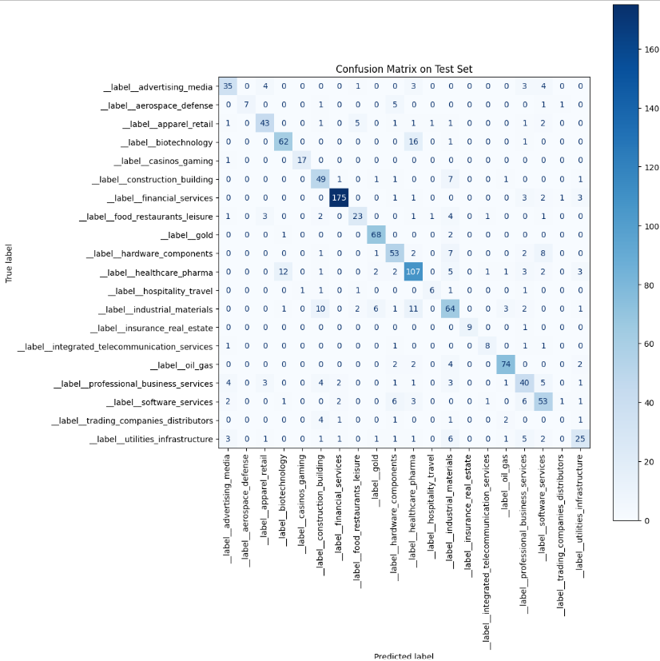
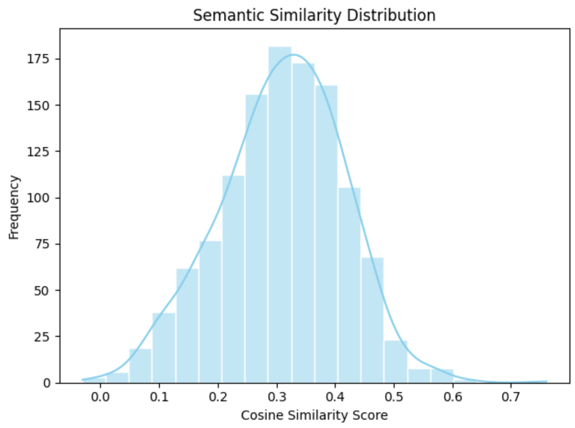

#  Company Classification with FastText

This project tackles the problem of classifying companies into industry categories based on their business description.  
It uses a FastText model trained on a labeled dataset and includes all steps: from data cleaning to model evaluation.

---

##  Project Structure

- `01_data_cleaning.ipynb`: Dataset cleaning and exploratory data analysis (EDA)
- `02_data_formatting.ipynb`: Data preparation for FastText (normalization, label mapping, formatting)
- `03_model_testing.ipynb`: Model evaluation, semantic analysis, and confusion matrix

---

##  Dataset

- Source: [Company Classification Dataset](https://github.com/Bicky23/Company-Classification-using-RoBERTa)
- 3,000+ companies with textual descriptions and industry tags  
- Tags grouped into **20 major categories** for balanced classification.

---

##  Approach

- Preprocessing: Normalization, removal of special characters, grouping of labels
- Modeling: FastText supervised classification
- Evaluation: Accuracy, confusion matrix, and semantic similarity analysis

---

##  Results

###  Accuracy: `76%`

> The model correctly predicted the category of 76% of companies in the test set.

> Most misclassifications occur between similar domains, such as *Biotechnology ↔ Healthcare* and *Construction ↔ Industrial Materials*.

---

###  Semantic Similarity

> Even incorrect predictions tend to be semantically close to the correct class, suggesting contextual understanding.

---

##  Conclusion

- FastText provides a fast, efficient baseline model for text classification
- Errors are largely between semantically related classes
- Future improvements: multi-label classification, larger training corpus, testing transformer models

---

###  Download the Model

You can download the trained FastText model here:  
👉 [Download final_model.bin](https://drive.google.com/file/d/1DRCSQIS1ORMafXsW-Ax32GQMiUaffiwr/view?usp=sharing)

> ⚠️ Warning: File size is ~770MB.

##  Author

👩‍💻 **Andreea Ichim**  
🔗 [LinkedIn](https://www.linkedin.com/in/andreeaichim1123)  
📧 andreeaichim1123@gmail.com
